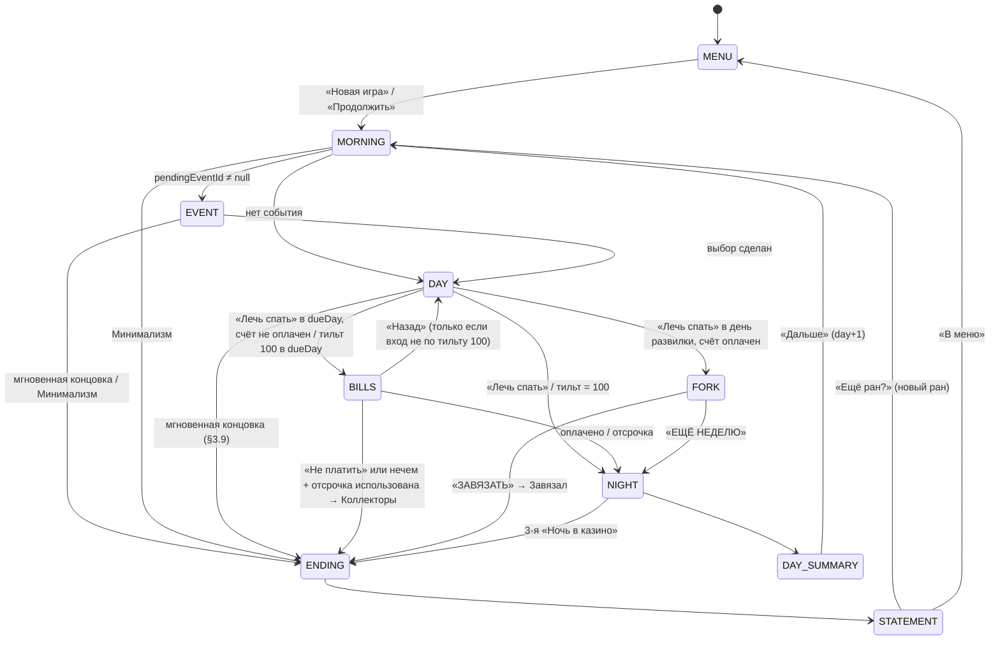

# GDD — Структура рана («4 недели жизни лудомана»)

> CD-01 · автор: Game Designer · 2026-09-25 · v1
> Основа: `design/creative-vision.md` (далее **CV**), `production/architecture.md` (далее **ARCH**), `production/tasks-creative.md`.
> Решения владельца (данность): ран = 28 дней + развилка «ЗАВЯЗАТЬ / ЕЩЁ НЕДЕЛЮ»; RTP слота 90%.
> Числа — v1 из CV. Пометка **[eco]** = итоговое значение утверждает economy-designer в `design/economy-v1.md`; в коде все такие числа живут только в `balance.ts` под ключом из §7.
> Тексты в кавычках — плейсхолдеры для writer (CD-11); коды отказов (`RejectReason`) — контракт для кода.

---

## 1. Overview

Ран — 28 игровых дней. Каждый день: **Утро** (автоматика + карточка события) → **День** (игрок тратит 100⚡ на действия «Жизни» и спины) → **Сон** (списания, проценты, тильт, бросок события). На дни 7/14/21/28 выставлен **Счёт**; одна отсрочка на ран, вторая неоплата — концовка «Коллекторы». На 28-й день после оплаты счёта — **развилка**: «ЗАВЯЗАТЬ» (только при долге 0, лучшая концовка) или «ЕЩЁ НЕДЕЛЮ» (продолжение с растущими счетами). Всего 7 концовок; каждая заканчивает ран и ведёт на экран **Выписки**. Деньги живут в двух местах: **кошелёк** (жизнь, счета) и **баланс казино** (только спины); между ними — мгновенный депозит и медленный вывод.

## 2. Player Fantasy

«Я вот-вот отыграюсь». Игрок управляет не удачей, а **потоком денег и временем**: откуда взять на счёт, что заложить, когда остановиться. Эстетики MDA: **Challenge** (дотянуть до счёта), **Narrative** (дуга мем → яма → выписка), **Discovery** (7 концовок, события), **Sensation** (Витрина), **Expression** (путь «честно» / «темки» / «ломбард»). SDT: автономия — несколько жизнеспособных путей к счёту; компетентность — все цены видны заранее; связанность — мама, Серёга, друзья, которые уходят.

---

## 3. Detailed Design

### 3.1 Состояние рана (поля, которые должны быть в `RunState`)

Дополняют ARCH ADR-005. Все деньги — целые ₽, ≥ 0.

| Поле | Тип | Старт | Смысл |
|---|---|---|---|
| `day` | int ≥1 | 1 | текущий день |
| `phase` | `'morning' \| 'event' \| 'day' \| 'bills' \| 'fork' \| 'night' \| 'daySummary' \| 'ended'` | `'morning'` | фаза (сохраняется, см. §3.12) |
| `location` | `'life' \| 'casino'` | `'life'` | где игрок (для спинов/действий Жизни) |
| `energy` | int 0..`ENERGY_PER_DAY` | 100 | ⚡ дня |
| `wallet` | int | 1000 | кошелёк |
| `casino` | int | 0 | баланс казино |
| `debtBank`, `debtMfo` | int | 0, 0 | долг по корзинам; `debt = debtBank + debtMfo` |
| `rep` | int `REP_MIN..REP_MAX` | 10 | ❤️ |
| `tilt` | int 0..100 | 0 | 🔥 |
| `items` | `Record<ItemId, 'owned' \| 'pawned'>` | все `owned` | 📱🚲💻🫖🎮 |
| `bet` | int ≥ `MIN_BET` | 100 | текущая ставка |
| `bonus` | `{ state: 'available' \| 'active' \| 'done' \| 'lost' \| 'declined'; wagerReq: int; wagered: int }` | `available`, 0, 0 | бонус 200% / вейджер |
| `withdrawals` | `{ amount: int; net: int; arriveDay: int }[]` | [] | выводы «на рассмотрении» |
| `bills` | `{ week: int; dueDay: int; fixed: int; status: 'upcoming' \| 'due' \| 'paid' \| 'deferred' }[]` | 4 счёта | см. §3.6 |
| `graceUsed` | bool | false | отсрочка использована (1 на ран) |
| `shiftsDone` | int | 0 | для повышений |
| `friendLoansThisWeek` | int | 0 | для −30% за следующий заём |
| `friendsBlocked` | bool | false | залипающий флаг |
| `familyHelpsToday` | int | 0 | лимит помощи семье |
| `borrowedToday` | int | 0 | займы банк/МФО за сегодня (антиабуз ❤️, §3.5.8) |
| `maxTiltToday` | int | 0 | максимум 🔥 за день (статистика «дни с тильтом ≥70») |
| `repayProgress` | int 0..1999 | 0 | остаток к следующему +1❤️ за погашение |
| `casinoNights` | int | 0 | «Ночей в казино» за ран |
| `casinoNightPending` | bool | false | текущая ночь — «Ночь в казино» |
| `energyModNextMorning` | int | 0 | модификатор ⚡ от событий (напр. −40) |
| `pendingEventId` | string \| null | null | событие, брошенное ночью |
| `eventCooldowns` | `Record<EventId, int>` | {} | день последнего показа |
| `endless` | bool | false | выбрано «Ещё неделю» хотя бы раз |
| `endingId` | EndingId \| null | null | |
| `rngState` | int | seed | ARCH ADR-003 |
| `stats` | RunStats | 0 | CD-09 |

### 3.2 Машина состояний

- `MENU`: если в сейве есть ран с `phase ≠ 'ended'` — кнопки «Продолжить» и «Новая игра» (подтверждение «Текущий ран будет потерян»). Иначе только «Новая игра».
- Выход в меню возможен из любой фазы, кроме `night` (атомарная, не прерывается). Ран сохраняется с текущей `phase`.

### 3.3 Время: день, неделя, энергия

- `week = ceil(day / 7)`. Неделя 1 = дни 1–7, …, неделя 4 = дни 22–28; в режиме «Ещё неделю» недели 5, 6, … по той же формуле.
- ⚡ не копится: каждое утро `energy = max(0, ENERGY_PER_DAY + energyModNextMorning)`, затем `energyModNextMorning = 0`.
- День **не** заканчивается сам при `energy = 0`. Он заканчивается только: (а) кнопкой «Лечь спать»; (б) тильтом 100 (§3.5.10); (в) концовкой.
- Если нет ни одного доступного действия, стоящего ⚡ (см. `canExecute`), кнопка «Лечь спать» переходит в акцентное состояние (UI-подсказка, не автоматический переход).
- Целевой темп: ~60 с реального времени на день (CV §5.2) → 28 дней ≈ 28–35 мин.

### 3.4 Фазы дня — точный порядок операций

**Сон (`night`)** — атомарная транзакция `day/sleep`, выполняется целиком и сохраняется одним сейвом.

| # | Шаг | Детали |
|---|---|---|
| N1 | «Ночь в казино» | только если `casinoNightPending`: `casino -= floor(casino × CASINO_NIGHT_LOSS_PCT)`; `casinoNights += 1`; затем проверка бонуса на сгорание (§3.5.3). Если `casinoNights ≥ CASINO_NIGHTS_FOR_ENDING` → концовка **«Ночь в казино ×3»**, остальные шаги не выполняются |
| N2 | Жизнь | обязательное списание `LIVING_COST` (§3.5.12 — правило недостачи) |
| N3 | Статистика дня | если `maxTiltToday ≥ TILT_T2` → `stats.tiltDays70 += 1`; флаг «день без спинов» для ачивки #9 (CD-13) |
| N4 | Проценты | `debtMfo = ceil(debtMfo × (1 + MFO_RATE_DAY))`, `debtBank = ceil(debtBank × (1 + BANK_RATE_DAY))`; `stats.interestPaid += Δ`. Проценты начисляются и на долг, созданный в N2 |
| N5 | Тильт | если `casinoNightPending`: `tilt = TILT_AFTER_CASINO_NIGHT`; иначе `tilt = max(0, tilt − TILT_SLEEP_DECAY)` |
| N6 | Бросок события | `rng < EVENT_CHANCE_PER_NIGHT` → выбрать из пула по весам среди подходящих (условия + кулдаун `EVENT_COOLDOWN_DAYS`) → `pendingEventId`. В ночь с дня 1 на 2 событие не бросается (обучение) |
| N7 | Сброс дневных счётчиков | `casinoNightPending = false`, `familyHelpsToday = 0`, `borrowedToday = 0`, `maxTiltToday = tilt`, `location = 'life'` |
| N8 | Итог дня | снимок для экрана `daySummary`: заработано, проиграно в казино, проценты за ночь, долг, изменение ❤️/🔥 |
| N9 | `day += 1`, `phase = 'daySummary'`, сейв | |

**Утро (`morning`)** — атомарная транзакция `day/wake` (запускается кнопкой «Дальше» на итоге дня или при старте рана).

| # | Шаг | Детали |
|---|---|---|
| M1 | Смена недели | если `day % 7 == 1` и `day > 1`: `friendLoansThisWeek = 0`; в режиме «Ещё неделю» создать счёт недели `week` (§3.6) |
| M2 | Счёт дня | каждый счёт с `dueDay == day` и `status ∈ {upcoming, deferred}` получает `status = 'due'` (для `deferred` статус остаётся `deferred`, но он становится оплачиваемым сегодня) |
| M3 | Выводы | все `withdrawals` с `arriveDay == day`: `wallet += net`, удалить из очереди, лог «Вывод одобрен» |
| M4 | Энергия | `energy = max(0, ENERGY_PER_DAY + energyModNextMorning)`; мод = 0 |
| M5 | Событие | если `pendingEventId` → `phase = 'event'`, игрок выбирает вариант, эффекты через общий pipeline (§3.8), `pendingEventId = null`, `eventCooldowns[id] = day`; мгновенные проверки концовок (§3.9) |
| M6 | «Минимализм» | проверка условия (§3.9) — после события |
| M7 | Подсказки | обучение (§3.11), только дни 1–2 |
| M8 | `phase = 'day'`, сейв | |

**День (`day`)**: игрок выполняет команды из §3.5 в любом порядке. После **каждой** команды: `applyInvariants` → мгновенные проверки концовок → проверка тильта 100 → сейв.

### 3.5 Механики внутри рана

Сводная таблица действий. «Где»: `L` — только при `location='life'`, `C` — только при `location='casino'`, `*` — везде. Проверки выполняются по порядку строк «Недоступно»; первая сработавшая даёт `RejectReason`. Одна функция `canExecute` используется и для кнопки, и для ядра (ARCH ADR-004).

| Действие (команда) | Где | ⚡ | Эффекты | Недоступно (`RejectReason` → текст) |
|---|---|---|---|---|
| Войти в казино `casino/enter` | L | 0 | `location='casino'` | — |
| Выйти из казино `casino/leave` | C | 0 | `location='life'`. При `tilt ≥ TILT_T2` UI требует 2 подтверждения (логике — одно) | — |
| Депозит `casino/deposit {amount}` | * | 0 | `wallet −= a`, `casino += a` (+бонус, §3.5.3) | `amount_below_min` → «Мин. депозит 50₽»; `no_money` → «В кошельке нет столько» |
| Вывод `casino/withdraw {amount}` | * | 0 | `casino −= a`; в очередь `{amount:a, net:floor(a×(1−WITHDRAW_FEE)), arriveDay: day+1}` | `bonus_locked` → «Бонус не отыгран: осталось N₽ оборота»; `amount_below_min` → «Мин. вывод 1000₽»; `no_money` → «На балансе нет столько» |
| Ставка `bet/set {value}` | * | 0 | `bet = clamp(value, MIN_BET, max(MIN_BET, casino))` | — |
| Спин `slot/spin` | C | 2 (0 при `tilt ≥ TILT_T2`) | §3.5.1 | `bet_below_min` → «Мин. ставка 50₽»; `no_money` → «Баланс казино пуст. ДЕПОЗИТ?»; `no_energy` → «Нет сил. Даже крутить» |
| Смена `work/shift` | L | 60 | §3.5.5 | `no_energy` → «Смена — 60⚡. Сил нет» |
| Темка `work/shady` | L | 30 | §3.5.6 | `no_energy` |
| Помочь семье `family/help` | L | 20 | `rep += 2`, `tilt −= 15`, `familyHelpsToday += 1` | `daily_limit` → «Сегодня ты уже помогал»; `no_energy` |
| Занять у друзей `friends/borrow` | L | 10 | §3.5.7 | `friends_blocked` → «Вы заблокированы»; `no_phone` → «Телефон в ломбарде»; `no_energy` |
| Кредит банка `bank/loan` | * | 0 | `wallet += BANK_LOAN`, `debtBank += BANK_LOAN`, `borrowedToday += BANK_LOAN` | `rep_too_low` → «Банку нужна ❤️ ≥ 15»; `debt_limit` → «Лимит долга 30 000₽» |
| Займ МФО `mfo/loan` | * | 0 | `wallet += MFO_LOAN`, `debtMfo += MFO_LOAN`, `borrowedToday += MFO_LOAN` | `debt_limit` |
| Погасить `debt/repay {amount}` | * | 0 | §3.5.8 | `no_debt` → «Долгов нет. Пока»; `amount_below_min` → «Мин. 500₽»; `no_money` |
| Заложить `pawn/pawn {item}` | * | 0 | `items[i]='pawned'`, `wallet += PAWN_VALUE[i]` | `item_not_owned` |
| Выкупить `pawn/redeem {item}` | * | 0 | `wallet −= ceil(PAWN_VALUE[i]×PAWN_REDEEM_MULT)`, `items[i]='owned'` | `item_not_pawned`; `no_money` → «Выкуп — 130%: N₽» |
| Оплатить счёт `bills/pay` | * | 0 | §3.6 | `not_due` → «Счёт через N дн.»; `no_money` → «Нужно N₽ в кошельке» |
| Отсрочка `bills/defer` | в `bills` | 0 | §3.6 | `grace_used` → «Отсрочка уже была» |
| Не платить `bills/refuse` | в `bills` | 0 | концовка «Коллекторы» | — |
| Лечь спать `day/sleep` | * | 0 | §3.4; при `location='casino'` и `tilt ≥ TILT_T2` — те же 2 подтверждения | — |
| ЗАВЯЗАТЬ `run/quit` | fork или L | 0 | концовка «Завязал» | `not_fork_day`; `bill_unpaid` → «Сначала счёт»; `has_debt` → «Долг N₽. Так не завязывают» |
| ЕЩЁ НЕДЕЛЮ `run/extend` | fork | 0 | §3.7 | `not_fork_day`; `bill_unpaid` |
| Выбор события `event/choose {0\|1}` | event | 0 | эффекты варианта | `option_unaffordable` → «Не хватает N₽» |

Стоимости ⚡ 0 для финансовых операций — осознанное отклонение от CV §5.2 (там «банк/ломбард» в списке трат ⚡): иначе при 0⚡ в день счёта игрок не может заложить вещь и получает софтлок. **[eco]** может ввести стоимость, если в `canExecute` сохранится разрешение при `phase='bills'`.

#### 3.5.1 Слот (подробно — CD-07, таблица выплат — economy-v1)

Порядок транзакции `slot/spin` (одна транзакция, результат до анимации, ARCH ADR-001):
1. Проверки `canExecute`. `bet = min(bet, casino)`; если `bet < MIN_BET` — отказ.
2. `allIn = (bet == casino)`. `energy −= (tilt ≥ TILT_T2 ? 0 : SPIN_ENERGY)`.
3. `casino −= bet`; если `bonus.state='active'`: `bonus.wagered += bet`.
4. Исход из таблицы весов (RTP 0.90, не зависит ни от чего), `payout = floor(bet × mult)`; `casino += payout`.
5. Флаги: `ldw = (mult > 0 && mult < 1)`, `nearMiss` (25% проигрышей, только визуал).
6. Тильт: `+TILT_ALLIN` если `allIn`; `+TILT_LOSS` если `mult < 1` (LDW тоже); `−TILT_WIN_BIG` если `mult ≥ 2`; при `mult == 1` без изменения. Clamp 0..100.
7. Бонус: если `active` и `wagered ≥ wagerReq` → `done` (лог «Бонус отыгран»); иначе если `casino < MIN_BET` → `lost` (лог «Бонус сгорел»).
8. Статистика (CD-09). 9. Мгновенные концовки: «Реферальная программа» (§3.9). 10. Если `tilt == 100` → «Ночь в казино» (§3.5.10).

#### 3.5.2 Кошелёк / баланс казино / вывод

- Спины — только с `casino`. Счета, займы, выкуп, погашение, темка-штраф, жизнь — только `wallet`.
- Депозит мгновенный, `DEPOSIT_MIN`. Быстрые суммы UI: 500 / 1000 / «всё».
- Вывод: мин. `WITHDRAW_MIN`, комиссия `WITHDRAW_FEE` (floor), зачисление утром `day+1` (шаг M3). Несколько выводов в очереди допустимы. Статус «на рассмотрении» с днём прихода виден в UI.
- Если ран кончается при непустой очереди выводов или `casino > 0` — эти деньги пропадают и отдельной строкой печатаются в Выписке («Остались у казино: N₽»).

#### 3.5.3 Бонус 200%

- Предлагается только при **первом депозите рана** (`bonus.state='available'`). Диалог депозита: чекбокс «ЗАБРАТЬ БОНУС 200%*» **включён по умолчанию** (пародия), Изнанка показывает ожидаемый остаток. Снял галочку → `declined`, больше не предлагается.
- Принят: `b = BONUS_MULT × min(a, BONUS_DEPOSIT_CAP)`; `casino += a + b`; `wagerReq = BONUS_WAGER_MULT × b`; `wagered = 0`; `state='active'`.
- Пока `active`: **весь** `casino` заблокирован для вывода (включая последующие депозиты). Депозиты разрешены.
- Выход из `active`: `wagered ≥ wagerReq` → `done`; `casino < MIN_BET` после спина или после «Ночи в казино» → `lost`. Отказаться от бонуса вручную нельзя (P0).
- «Ожидаемый остаток» для Изнанки: формула — economy-v1; заглушка: `max(0, casino − (1 − RTP) × (wagerReq − wagered))`.

#### 3.5.4 Ставка

`MIN_BET = 50`. Кнопки: `½` → `max(MIN_BET, floor(bet/2))`; `×2` → `min(casino, bet×2)`; `MIN` → `MIN_BET`; `ДОДЕП ВСЁ` → `bet = casino` (доступна при `casino ≥ MIN_BET`). Ставка не может превысить `casino` в момент спина (шаг 1 клампит).

#### 3.5.5 Смена

`energy −= 60`; `pay = round(SHIFT_PAY × (1 + SHIFT_PROMO_STEP × promos) × repMult)`, где `promos = min(SHIFT_PROMO_MAX, floor(shiftsDone / SHIFT_PROMO_EVERY))` (до инкремента), `repMult` — §4. `wallet += pay`; `shiftsDone += 1`; `tilt −= 10`. Если после инкремента `shiftsDone % 5 == 0` и `promos < 5` — лог «Повышение!».

#### 3.5.6 Темка

`energy −= 30`; `rep −= 2` (всегда, первым делом). Бросок `r1`: `r1 < SHADY_SUCCESS` → `wallet += 100 × rng.int(18, 28)`. Иначе — штраф `SHADY_FINE` (обязательное списание, §3.5.12); затем если `rep ≤ SHADY_JAIL_REP` (после −2) — бросок `r2 < SHADY_JAIL_CHANCE` → концовка «Сел». Порядок бросков фиксирован (для детерминизма сидов).

#### 3.5.7 Друзья

- Недоступно, если `friendsBlocked` или `items.phone == 'pawned'` (выкуп телефона возвращает доступ, если нет блокировки).
- `amount = round10(min(FRIEND_MAX, FRIEND_BASE + FRIEND_PER_REP × rep) × (1 − FRIEND_WEEKLY_DECAY)^friendLoansThisWeek)`, `rep` — до списания. Если `amount < 50` → отказ `friends_broke` («Друзьям самим не хватает»).
- `wallet += amount`; `rep −= 2`; `friendLoansThisWeek += 1`. Это **не долг** — цена в ❤️.
- Как только `rep ≤ 0` (в любой момент рана, от любого источника) → `friendsBlocked = true` навсегда (залипает; «Вы заблокированы»).
- Ограничение: при `rep ≤ 0` формула не вызывается (блокировка раньше).

#### 3.5.8 Банк / МФО / погашение

- Лимит: займ возможен, если `debt + LOAN ≤ DEBT_LIMIT`. Проценты и принудительные недостачи могут вывести `debt` выше лимита — это разрешено, но новые займы тогда недоступны.
- Банк дополнительно требует `rep ≥ BANK_REP_MIN` в момент займа.
- Проценты — сложные, только ночью (N4), `ceil` до рубля.
- Погашение: `a ≥ REPAY_MIN` либо `a == debt` при `debt < REPAY_MIN`; `a ≤ min(wallet, debt)` (UI клампит). Распределение: сначала `debtMfo`, потом `debtBank`.
- ❤️ за погашение (антиабуз «взял-вернул»): `eligible = max(0, a − borrowedToday)`; `borrowedToday = max(0, borrowedToday − a)`; `repayProgress += eligible`; `rep += floor(repayProgress / REPAY_REP_STEP)`; `repayProgress %= REPAY_REP_STEP`. Долговая часть счёта (§3.6) проходит через ту же функцию.

#### 3.5.9 Ломбард

5 вещей (`phone` 3000, `bike` 2500, `laptop` 6000, `teaset` 1500, `console` 4000 **[eco]**). Заложить: `+value` в кошелёк. Выкуп: `ceil(value × 1.30)`, в любой момент рана, срока нет. Заложенная вещь исчезает из «Жизни». Эффекты вещей в P0: без `phone` — нет друзей; число `owned` влияет на «Минимализм» и оценку «Завязал». Остальные вещи эффектов не имеют (P1: «Комната»).

#### 3.5.10 Тильт (подробно — CD-09)

- Источники: спин-проигрыш `+8` (LDW тоже), all-in `+5`, события. Стоки: сон `−25`, семья `−15`, смена `−10`, выигрыш ≥2x `−3`, события.
- **Не-спиновые источники** (события) не поднимают тильт выше `TILT_NON_SPIN_CAP = 99`: «Ночь в казино» случается только в казино.
- Пороги включительно: `≥ 40` (`TILT_T1`) — баннер «ОТЫГРАЙСЯ!», агрессивный UI; `≥ 70` (`TILT_T2`) — спин 0⚡, выход из казино и «Лечь спать» из казино через 2 подтверждения; день учитывается в `stats.tiltDays70` (через `maxTiltToday`, шаг N3); `== 100` — «Ночь в казино».
- **Ночь в казино**: после завершения транзакции спина, где `tilt` стал 100: `casinoNightPending = true`, день завершается принудительно. Если сегодня `dueDay` неоплаченного счёта → `phase='bills'` в режиме **без «Назад»**; иначе сразу `night`. Если сегодня день развилки и счёт оплачен → `fork` (без «Назад»). −20% баланса казино — в N1.
- Тильт не влияет на исход спина.

#### 3.5.11 События сна (контент — CD-11, система — CD-12)

- Бросок в N6, показ в M5. Одно событие за утро максимум. 2 варианта. Эффекты — только ключи общего pipeline: `wallet`, `casino`, `rep`, `tilt`, `energyModNextMorning`/`energyToday`, `debtMfo`, `freespins`, `flag`.
- Эффект «−40⚡ завтра» из CV в формулировке карточки означает **сегодняшний** день (карточка показывается утром): пишется как `energyToday: −40`, применяется после M4.
- Правило контента: у каждого события хотя бы один вариант всегда доступен (без стоимости в ₽). Вариант со стоимостью в ₽ недоступен при `wallet < cost` (`option_unaffordable`) — события не создают недостачу.
- **Фриспины** (push «Мы скучаем»): `n = FREESPINS_COUNT` спинов по `MIN_BET` без списания, считаются пакетом одной транзакцией (исходы из той же таблицы). Выигрыш `w` → `casino += w`; если `w > 0`: блокировка как у бонуса — если `bonus.state='active'`, то `wagerReq += FREESPIN_WAGER_MULT × w`, иначе `bonus = {state:'active', wagerReq: 30×w, wagered:0}` (даже если основной бонус уже `done/lost/declined`). Фриспины не меняют тильт и ⚡; в статистике — отдельной строкой.

#### 3.5.12 Правило недостачи (обязательные списания)

Обязательные списания: `LIVING_COST` (N2), `SHADY_FINE`, принудительные эффекты событий. Если `wallet < X`: `short = X − wallet`; `wallet = 0`; `debtMfo += short` (лимит долга игнорируется); лог «Недостачу оформили на тебя в МФО: N₽»; `stats.forcedMfo += short`. Баланс казино и вещи не трогаются. **Кошелёк никогда не бывает отрицательным.**

### 3.6 Счета и дедлайны

- Счета недель 1–4: `dueDay = 7w`, `fixed = BILLS[w]` = 3500 / 5500 / 7500 / 10000 **[eco]**. Статус `upcoming` до утра `dueDay`.
- **Сумма к оплате** (считается в момент показа/оплаты): `total = fixed + ceil(BILL_DEBT_SHARE × debt)`. Долговая часть **гасит долг** (МФО → банк) и идёт в ❤️-прогресс; фиксированная часть просто списывается.
- Оплата только в `dueDay` (кнопка «Оплатить счёт» в «Жизни» или экран `bills`), только из `wallet`, только целиком: `wallet ≥ total`. Досрочно — нельзя (`not_due`).
- Счётчик в «Жизни» всю неделю: «До счёта N дн. · нужно ≈X₽» (X пересчитывается от текущего долга).
- **Экран `bills`** открывается при «Лечь спать» (или тильте 100) в `dueDay`, если счёт не оплачен. Кнопки:
  1. «Оплатить X₽» — если `wallet ≥ total` → `status='paid'` → дальше `night` (или `fork`, если это день развилки).
  2. «Отсрочка: завтра X×1.5» — если `!graceUsed`: `graceUsed = true`; `status='deferred'`; `dueDay += 1`; `fixed = ceil(fixed × (1 + GRACE_PENALTY))`; → `night`. Долговая часть завтра считается заново.
  3. «Не платить» — концовка «Коллекторы». Если (1) и (2) недоступны, остаётся только (3) и «Назад».
  4. «Назад» — вернуться в `day` (заложить вещь, взять МФО и т.п.). Недоступно при входе по тильту 100.
- **Отсрочка — одна на ран** (`GRACE_PER_RUN = 1`). Второй раз не оплатить любой счёт = «Коллекторы». Отсроченный счёт, не оплаченный на следующий день, = «Коллекторы».
- Отсрочка не сдвигает следующие счета: после отсрочки счёта 1 на день 8 счёт 2 по-прежнему на дне 14.

### 3.7 Развилка «ЗАВЯЗАТЬ / ЕЩЁ НЕДЕЛЮ»

- **День развилки** = `dueDay` счёта недели 4 (28, или 29 при отсрочке); в режиме «Ещё неделю» — `dueDay` каждого следующего счёта (35, 42, …).
- Как только счёт дня развилки `paid`: в «Жизни» появляется блок развилки. «ЗАВЯЗАТЬ» активна только при `debt == 0` (иначе подпись «Долг N₽. Погаси и возвращайся»). Игрок может продолжать день (погасить долг, выкупить вещи), затем нажать «ЗАВЯЗАТЬ».
- «Лечь спать» в день развилки после оплаты открывает модалку `fork`: [ЗАВЯЗАТЬ] (при `debt == 0`) / [ЕЩЁ НЕДЕЛЮ] / [Назад] (кроме входа по тильту 100).
- **При `debt > 0` единственный путь дальше — «Ещё неделю»** («Долг не отпускает»). Это прямое следствие механики, а не наказание.
- «ЗАВЯЗАТЬ» при непустой очереди выводов или `casino > 0` → предупреждение: «На сайте осталось N₽. Вывод придёт завтра. Завтра не будет». Подтверждение → концовка.
- «ЕЩЁ НЕДЕЛЮ»: `endless = true`; → `night`; утром M1 создаётся счёт недели `w`: `dueDay = 7w`, `fixed = round100(BILLS[4] × ENDLESS_BILL_GROWTH^(w−4))` (13 500, 18 300, 24 600 … при 1.35) **[eco]**. `graceUsed` не обновляется. Все остальные правила без изменений. Метрика рана — `weeksSurvived = week − 1` на момент концовки (в Выписку).
- Мелкая подпись в модалке (Изнанка-голос): «Ещё неделя стоит минимум X₽ счёта. Казино называет это "ещё один раз"».
- Объём: CV помечала бесконечный режим как P1 (CD-31), но владелец включил выбор в структуру рана. P0 = развилка + рост счетов из этого параграфа (дёшево: переиспользует петлю). В P1 (CD-31) остаются ачивка «Вечный додеп» и доп. контент. **Требует подтверждения producer** (объём CD-05 растёт на ~1 задачу).
- Фолбэк, если producer режет: флаг `FEATURE_ENDLESS=false` → кнопки «ЕЩЁ НЕДЕЛЮ» нет; при `debt > 0` в день развилки после «Лечь спать» → концовка «Коллекторы» (текст-вариант «долг не закрыт»).

### 3.8 Общий pipeline эффектов

Любое изменение (действие, событие, ночь) проходит: `applyEffect` → `applyInvariants` (целые, `wallet/casino/debt* ≥ 0`, `energy ∈ [0,100]`, `tilt ∈ [0,100]`, `rep ∈ [REP_MIN, REP_MAX]`) → флаги-следствия (`friendsBlocked` при `rep ≤ 0`) → мгновенные концовки → тильт-100 → сейв. `rep` клампится в `[−15, 40]` **после** проверки «Семья ушла» (т.е. проверяется неклампленное значение, но `−15` и так порог).

### 3.9 Концовки: триггеры, точки проверки, приоритет

| # | ID | Триггер (точно) | Где проверяется | Итог |
|---|---|---|---|---|
| 1 | `jailed` «Сел» | провал темки при `rep ≤ −10` (после −2) и `r2 < 0.25` | внутри `work/shady` | мгновенно |
| 2 | `collectors` «Коллекторы» | `bills/refuse`; ИЛИ счёт не оплачен при `graceUsed` (кнопок оплаты/отсрочки нет → игрок жмёт «Не платить»); ИЛИ фолбэк §3.7 | экран `bills` / `fork` | мгновенно |
| 3 | `family_left` «Семья ушла» | `rep ≤ REP_FAMILY_LEAVES` (−15) после любого изменения ❤️ | pipeline §3.8 (день и событие) | мгновенно |
| 4 | `casino_nights` «Ночь в казино ×3» | `casinoNights` достиг 3 | шаг N1 | мгновенно, ночь прерывается |
| 5 | `minimalism` «Минимализм» | `wallet + casino < MINIMALISM_MONEY (50)` И все 5 вещей `pawned` И `canExecute(bank/loan) ≠ ok` И `canExecute(mfo/loan) ≠ ok` | шаг M6 (после вывода и события) | до начала дня |
| 6 | `referral` «Реферальная программа» (секрет) | `casino ≥ REFERRAL_CASINO (100 000)` сразу после выплаты спина | шаг 9 спина | мгновенно |
| 7 | `quit` «Завязал» | `run/quit` в день развилки, счёт оплачен, `debt == 0` | команда | оценка ниже |

- **Приоритет** при нескольких в одной транзакции (выигрывает меньший #): `jailed` > `collectors` > `family_left` > `casino_nights` > `minimalism` > `referral` > `quit`. Реально возможные пересечения: темка (`jailed` и `family_left` одновременно → `jailed`); событие утром (`family_left` и `minimalism` → `family_left`).
- **Оценка «Завязал»**: `owned = число вещей 'owned'`. **A**: `owned == 5` И `rep ≥ QUIT_GRADE_A_REP (20)`. **C**: `owned == 0`. **B**: всё остальное. Выкупленные вещи считаются `owned`.
- При срабатывании: `endingId` пишется, `phase='ended'`, сейв рана; в `dodepaMeta`: концовка в коллекцию, ачивки #24–30, lifetime-статистика. Затем экран концовки → Выписка.
- **Победа** — только `quit`. `referral` формально «выигрыш», в Выписке подаётся как худший исход. Всё остальное — поражение.

### 3.10 Эмоциональная дуга ↔ механика (для событий и тюнинга)

| Дни | Фаза CV | Что задаёт механика |
|---|---|---|
| 1–7 | Медовый месяц | счёт 3500 легко закрыть сменами (7 смен ≈ 6500 + 1000 старт − 1800 жизнь); бонус 200% манит |
| 8–14 | Привычка | счёт 5500, долговая часть счёта растёт, первые тильт ≥ 40 |
| 15–21 | Яма | счёт 7500 ≈ весь чистый заработок недели сменами — любая потеря в казино толкает в МФО/ломбард/темки |
| 22–28 | Развязка | счёт 10 000 + 10% долга > заработка недели (≈ 6500 чистыми) → нужен запас, ломбард или займ; «ЗАВЯЗАТЬ» требует долг 0 |

Пул событий фильтруется по фазе (веса — CD-12).

### 3.11 Обучение (дни 1–2) и первые 3 минуты

Подсказки — неблокирующие плашки с «Понял», по одной, показываются в первом ране (флаг `meta.tutorialDone`; в Настройках «Показать подсказки снова»). `HowToPlay` заменяется памяткой на 10 строк (CD-11).

| Триггер | Подсказка (плейсхолдер) |
|---|---|
| утро дня 1 | «Это твоя жизнь. 100⚡ на день. Счёт 3500₽ через 7 дней» → стрелка на счётчик |
| первый раз в `day` | «Смена = 900₽. Честно, медленно» → подсветка «Смена» |
| первый вход в казино | «Спины идут только с баланса казино. Сначала ДЕПОЗИТ» |
| первый депозит (диалог) | «Бонус 200%*. *Весь баланс заблокирован до оборота ×30» → кнопка 👓 «Посмотри, что это значит» |
| первый LDW | «Витрина празднует. Нажми 👓» |
| `tilt ≥ 40` впервые | «🔥 Тильт растёт от проигрышей. Сон и семья его гасят» |
| конец энергии впервые | «Кончились силы — ложись спать. Каждая ночь стоит 300₽» |
| утро дня 2 | «Проценты и расходы списываются ночью. Смотри итог дня» |
| день 2, первый вывод | «Вывод приходит завтра утром. Счета платятся только из кошелька» |

**Сценарий первых 3 минут** (ожидаемый путь; все шаги — ≤ 3 клика до спина):
1. 0:00 Меню → «Новая игра». Экран сайта «ДОДЕП КАЗИНО», таймер бонуса тикает. Плашка утра дня 1.
2. 0:15 Панель «Жизнь»: день 1/28, ⚡100, кошелёк 1000, счёт 3500 через 7 дн. Подсказка про смену.
3. 0:30 Игрок видит пульсирующий «ДЕПОЗИТ» → депозит 500, галочка бонуса включена → баланс казино 1500 (бонус 1000), вейджер 30 000. Подсказка «*весь баланс заблокирован».
4. 0:50 Спины по 100: первые LDW с фанфарами, подсказка «нажми 👓» → Изнанка: «ВЫИГРЫШ +50₽» = «−50₽». Тильт растёт, баннер «ОТЫГРАЙСЯ!» при 40.
5. 1:40 Либо баланс казино сгорает (бонус `lost`), либо игрок сам выходит → «Жизнь»: смена −60⚡ +900₽ (⚡ осталось меньше, чем потратил на спины — видно цену времени).
6. 2:20 ⚡ кончилась → подсказка про сон → «Лечь спать» → Итог дня (−300 жизнь, проиграно N₽).
7. 2:40 Утро дня 2 → подсказка про проценты/вывод. Игрок понимает цикл «день — счёт через 6 дней».

### 3.12 UI-состояния (контракт для UX CD-15 / UI CD-16)

**Экраны по `phase`:**

| `phase` | Экран | Разрешено | Запрещено |
|---|---|---|---|
| `morning` | переход «Утро дня N» (≤ 1 с, пропуск кликом) | — | все команды |
| `event` | карточка, 2 кнопки (←/→), причина недоступности на кнопке | `event/choose`, 👓 | всё остальное |
| `day` | лобби + слот + «Жизнь» | все из §3.5 по `canExecute` | `event/choose` |
| `bills` | модалка счёта (§3.6) | pay / defer / refuse / «Назад»* | прочее |
| `fork` | модалка развилки | quit / extend / «Назад»* | прочее |
| `night` | не отображается (атомарно) | — | — |
| `daySummary` | бумажный «Итог дня» (Изнанка-стиль) | «Дальше», 👓 | — |
| `ended` | экран концовки → Выписка | «Ещё ран?», «В меню» | — |

\* «Назад» скрыт при входе по тильту 100.

**Постоянные индикаторы в «Жизни»:** день `N/28` (в endless — `N · неделя W`), ⚡, кошелёк, баланс казино, долг (банк/МФО раздельно в Изнанке) и «проценты за ночь ≈ N₽», ❤️, 🔥 (цвет по порогам), вещи (заложенные — пустые слоты), «До счёта N дн. · ≈X₽» (в `dueDay` — красный «СЕГОДНЯ»), выводы «на рассмотрении» с днём прихода, статус бонуса (`active`: прогресс `wagered/wagerReq`), «Ночей в казино: k/3» (только в Изнанке).

**Состояния кнопок:** недоступная кнопка видима, серая, с текстом `RejectReason` в тултипе/подписи — никогда не скрывается (кроме «ЕЩЁ НЕДЕЛЮ» при `FEATURE_ENDLESS=false` и «ЗАВЯЗАТЬ» вне дня развилки).

**Тильт-состояния UI:** `<40` норма; `40–69` баннер «ОТЫГРАЙСЯ!», ускоренный пульс CTA; `70–99` + спин «0⚡», двойное подтверждение выхода/сна из казино («Точно уходишь? Следующий может зайти» → «Точно-точно?»); `100` → полноэкранная плашка «Ночь в казино» → `bills`/`fork`/`night`.

**Особые состояния:** `location='casino'` — панель действий «Жизни» (смена/темка/семья/друзья) серая с подписью «Ты в казино»; финансовые операции доступны. День развилки — блок «ЗАВЯЗАТЬ / ЕЩЁ НЕДЕЛЮ» наверху «Жизни».

---

## 4. Formulas

Переменные — поля §3.1, константы — §7.

- `debt = debtBank + debtMfo`
- `repMult = rep < 0 ? SHIFT_REP_PENALTY_MULT (0.70) : 1 + min(SHIFT_REP_BONUS_CAP (0.30), max(0, rep − 10) × SHIFT_REP_BONUS_STEP (0.01))`
- `shiftPay = round(900 × (1 + 0.12 × min(5, floor(shiftsDone/5))) × repMult)` → диапазон 630…1872₽. Пример: 10 смен сделано, rep 18 → `900 × 1.24 × 1.08 = 1205`.
- `shadyReward = 100 × U{18..28}` (EV успеха 2300₽); `EV(темка) = 0.55×2300 − 0.45×1500 = 590₽` за 30⚡ и −2❤️ (для сравнения смена ≈ 900₽ за 60⚡ без цены в ❤️) **[eco]**.
- `friendAmount = round10(min(2000, 300 + 50×rep) × 0.7^k)`; пример rep 10, k = 1 → `800 × 0.7 = 560`.
- `interest_night = ceil(debtMfo×1.01) − debtMfo + ceil(debtBank×1.003) − debtBank`; 3000₽ МФО за 28 ночей → `3000 × 1.01^28 ≈ 3964₽`.
- `billTotal = fixed + ceil(0.10 × debt)`; отсрочка `fixed' = ceil(fixed × 1.5)`.
- `endlessBill(w) = round100(10000 × 1.35^(w−4))`, w ≥ 5.
- `withdrawNet = floor(a × 0.95)`.
- `bonus = 2 × min(a, 5000)`; `wagerReq = 30 × bonus`; ожидаемая потеря на отыгрыше `= (1 − 0.90) × wagerReq = 3 × bonus = 6 × min(a,5000)` > баланса `a + bonus = 3a` → ожидаемый остаток ≈ 0 (формула Изнанки — economy-v1).
- `casinoNightLoss = floor(casino × 0.20)`.
- `redeem = ceil(value × 1.30)`.
- Округления: `round` — выплаты/заработки; `ceil` — всё, что платит игрок (проценты, выкуп, штрафы, долговая часть счёта); `floor` — выплаты казино и вывод.

## 5. Edge Cases

| # | Ситуация | Поведение |
|---|---|---|
| E1 | **Отрицательный кошелёк после штрафа** (темка −1500 при кошельке 400; жизнь 300 при кошельке 0) | Кошелёк → 0, недостача → `debtMfo` сверх лимита (§3.5.12). Лог и строка в Выписке. Может выключить займы → путь к «Минимализму» |
| E2 | **Вывод в день счетов** | Деньги приходят утром `day+1` → на сегодняшний счёт не идут. Диалог вывода в `dueDay` показывает предупреждение «Счёт — сегодня, деньги — завтра». Выход: заложить вещь / МФО / отсрочка (+50%), тогда вывод успевает к отсроченному сроку. В день развилки вывод = деньги пропадут при «ЗАВЯЗАТЬ» (предупреждение §3.7) |
| E3 | **Тильт 100 во время активного бонуса** | −20% от всего `casino` (включая бонусную часть), `wagered`/`wagerReq` не меняются, блокировка остаётся; если после этого `casino < 50` → бонус `lost`. Потеря не считается спином (не входит в оборот и фактический RTP), в Выписке — строка «Ночь в казино: −N₽» |
| E4 | Тильт 100 в `dueDay` при неоплаченном счёте | `bills` без «Назад»: оплатить (если хватает) / отсрочка / «Не платить». Вывести/заложить уже нельзя — ночь началась |
| E5 | Тильт 100 от события | Невозможен: не-спиновые источники клампятся на 99 |
| E6 | Энергия 0, `tilt < 70` | Спины недоступны (`no_energy`); вход в казино разрешён; финансовые операции и «Лечь спать» доступны |
| E7 | Энергия 0, `tilt ≥ 70` | Спины бесплатны → игрок может крутить до 100 (задумано: «не замечаешь, как летит время») |
| E8 | `bet > casino` | Клампится к `casino` в момент спина; если `casino < 50` — отказ |
| E9 | ДОДЕП ВСЁ при `casino < 50` | Кнопка недоступна |
| E10 | Погашение больше долга / кошелька | UI клампит к `min(wallet, debt)`; ядро отклоняет некорректный `amount` без изменения состояния |
| E11 | Долг < 500 | Разрешено погасить ровно `debt` |
| E12 | Проценты вывели долг за 30 000 | Разрешено; займы недоступны (`debt_limit`) |
| E13 | Взял МФО и сразу погасил | ❤️ не начисляются (`borrowedToday`) |
| E14 | Телефон заложен → выкуплен | Друзья снова доступны, если `friendsBlocked == false` |
| E15 | ❤️ поднялась выше 0 после блокировки | Блокировка остаётся (залипает) |
| E16 | Выкуп без денег | `no_money` с точной суммой |
| E17 | Событие с денежным вариантом при нехватке | Вариант недоступен; второй всегда доступен (правило контента) |
| E18 | Две концовки в одной транзакции | Приоритет §3.9 |
| E19 | Перезагрузка во время анимации спина | Результат уже в сейве (ARCH ADR-001); после загрузки — фаза `day`, баланс актуален |
| E20 | Перезагрузка в `event` / `bills` / `fork` / `daySummary` | Восстанавливается та же фаза; событие — то же (`pendingEventId` в сейве), RNG не перебрасывается |
| E21 | Отсрочка счёта 4 | День развилки = 29; в день 29 утром счёт `deferred` оплачиваем, неделя 5 формально началась, но новый счёт недели 5 создаётся только при `endless` |
| E22 | Отсрочка счёта 1, затем неоплата счёта 3 | «Коллекторы» (отсрочка одна на ран) |
| E23 | `debt > 0` в день развилки | «ЗАВЯЗАТЬ» недоступна; путь — «Ещё неделю» (или фолбэк §3.7) |
| E24 | «ЗАВЯЗАТЬ» с деньгами в казино / выводом в очереди | Предупреждение; деньги потеряны, строка в Выписке |
| E25 | Бонус при первом депозите > 5000 | Бонус от 5000 (=10 000); остаток депозита тоже заблокирован |
| E26 | Фриспины при уже `done` бонусе | Новая блокировка на весь баланс казино (×30 от выигрыша фриспинов) |
| E27 | «Реферальная программа» через депозит | Невозможна: проверка только после выплаты спина |
| E28 | Бесконечные ❤️ через «Помочь семье» | Лимит `FAMILY_HELP_DAILY = 1` **[eco]** |

**Деградирующие стратегии (Sirlin) и защита:**
- «Только смены» (1 смена/день, грубо): недели 1–3 закрываются с минимальным запасом, счёт недели 4 (10 000) без ломбарда/займа/запаса — нет. Честный путь реален, но требует решений (цель CD-02: 50–65% побед без ломбарда). Не доминирует — ОК; проверяет economy-v1.
- «Только темки»: ❤️ падает на 2 за темку → блокировка друзей, банк, затем «Сел»/«Семья ушла». Защищено.
- «Ломбард всё»: выигрывает, но оценка «Завязал» C и строка в Выписке. Цена видна (пиллар 3).
- «Взял-вернул ради ❤️»: закрыто `borrowedToday`.
- «Сейв-скам спинов»: `rngState` в сейве, результат до анимации.
- «Бонус как халява»: ожидаемый остаток ≈ 0, Изнанка это показывает.

## 6. Dependencies

| Система | Направление | Контракт |
|---|---|---|
| economy-v1 (CD-02) | → сюда | все значения §7; формула ожидаемого остатка бонуса; таблица выплат; проверка стратегий |
| Слот (CD-07) | ↔ | `SpinResult {bet, outcomeId, multiplier, payout, reels, ldw, nearMiss, allIn}`; спин вызывает хуки тильта, бонуса, концовки `referral`, тильт-100 |
| Тильт / статистика (CD-09/10) | ← события | точные числа и честные двойники; метрики Выписки, `tiltDays70`, `forcedMfo`, `interestPaid`, потери «Ночи в казино», `weeksSurvived` |
| События (CD-11/12) | ↔ | ночью бросок (N6), утром показ (M5); эффекты — ключи pipeline §3.8; правило «один вариант всегда доступен» |
| Мета / ачивки (CD-13) | ← | `runEnded {endingId, grade}`, счётчики для ачивок (#9 неделя без спинов, #10 смены, #12 семья, #14 МФО, #15/16 ломбард, #17/18 бонус, #19 выводы, #21 тильт 100, #24–30 концовки) |
| UX / UI (CD-15/16/17) | ← | `phase`, `location`, `canExecute → RejectReason`, индикаторы §3.12 |
| Архитектура (ARCH) | — | команды §3.5 расширяют `Command`; `RejectReason` — перечисление; ночь и утро — атомарные команды `day/sleep`, `day/wake`; сейв после каждой команды |

## 7. Tuning Knobs (`balance.ts`)

Кат.: F — feel, C — curve, G — gate. Все **[eco]** (v1 = CV, если не отмечено иное).

| Ключ | v1 | Кат. | Диапазон | Примечание |
|---|---|---|---|---|
| `RUN_DAYS` | 28 | G | — | решение владельца |
| `ENERGY_PER_DAY` | 100 | G | — | |
| `START_WALLET` / `START_REP` / `START_BET` | 1000 / 10 / 100 | C | | |
| `LIVING_COST` | 300 | C | 200–400 | |
| `BILLS` | [3500, 5500, 7500, 10000] | C | | |
| `BILL_DEBT_SHARE` | 0.10 | C | 0.05–0.2 | |
| `GRACE_PER_RUN` | 1 | G | 1 | интерпретация GD (CV неоднозначна) |
| `GRACE_PENALTY` | 0.5 | C | | |
| `ENDLESS_BILL_GROWTH` | 1.35 | C | | |
| `FEATURE_ENDLESS` | true | G | | ждёт producer |
| `MIN_BET` / `DEPOSIT_MIN` | 50 / 50 | G | | `DEPOSIT_MIN` — предложение GD |
| `SPIN_ENERGY` | 2 | G | 1–3 | |
| `WITHDRAW_MIN` / `WITHDRAW_FEE` | 1000 / 0.05 | C | | |
| `BONUS_MULT` / `BONUS_DEPOSIT_CAP` / `BONUS_WAGER_MULT` | 2 / 5000 / 30 | C | | |
| `FREESPINS_COUNT` / `FREESPIN_WAGER_MULT` | 50 / 30 | C | | фриспины по `MIN_BET` |
| `TILT_LOSS` / `TILT_ALLIN` / `TILT_WIN_BIG` | 8 / 5 / 3 | F | | |
| `TILT_SLEEP_DECAY` / `TILT_FAMILY` / `TILT_SHIFT` | 25 / 15 / 10 | F | | |
| `TILT_T1` / `TILT_T2` / `TILT_MAX` | 40 / 70 / 100 | G | | |
| `TILT_NON_SPIN_CAP` | 99 | G | | предложение GD |
| `TILT_AFTER_CASINO_NIGHT` | 50 | F | 30–75 | предложение GD: без него −25 от 100 = 75 ≥ T2 и мгновенная спираль |
| `CASINO_NIGHT_LOSS_PCT` / `CASINO_NIGHTS_FOR_ENDING` | 0.20 / 3 | C/G | | |
| `SHIFT_ENERGY` / `SHIFT_PAY` | 60 / 900 | C | | |
| `SHIFT_PROMO_EVERY` / `SHIFT_PROMO_STEP` / `SHIFT_PROMO_MAX` | 5 / 0.12 / 5 | C | | |
| `SHIFT_REP_BONUS_STEP` / `SHIFT_REP_BONUS_CAP` / `SHIFT_REP_PENALTY_MULT` | 0.01 / 0.30 / 0.70 | C | | |
| `SHADY_ENERGY` / `SHADY_REP` / `SHADY_SUCCESS` | 30 / −2 / 0.55 | C | | |
| `SHADY_REWARD_MIN/MAX` / `SHADY_FINE` | 1800 / 2800 / 1500 | C | | шаг 100 |
| `SHADY_JAIL_REP` / `SHADY_JAIL_CHANCE` | −10 / 0.25 | G | | |
| `FRIEND_ENERGY` / `FRIEND_BASE` / `FRIEND_PER_REP` / `FRIEND_MAX` | 10 / 300 / 50 / 2000 | C | | |
| `FRIEND_WEEKLY_DECAY` / `FRIEND_REP` | 0.30 / −2 | C | | |
| `FAMILY_ENERGY` / `FAMILY_REP` / `FAMILY_HELP_DAILY` | 20 / +2 / 1 | C/G | | лимит — предложение GD |
| `BANK_LOAN` / `BANK_RATE_DAY` / `BANK_REP_MIN` | 5000 / 0.003 / 15 | C/G | | |
| `MFO_LOAN` / `MFO_RATE_DAY` | 3000 / 0.01 | C | | |
| `DEBT_LIMIT` | 30000 | G | | |
| `REPAY_MIN` / `REPAY_REP_STEP` | 500 / 2000 | C | | |
| `FIN_ACTION_ENERGY` | 0 | G | 0–10 | отклонение от CV, см. §3.5 |
| `PAWN_VALUE` | phone 3000, bike 2500, laptop 6000, teaset 1500, console 4000 | C | | |
| `PAWN_REDEEM_MULT` | 1.30 | C | | |
| `REP_MIN` / `REP_MAX` / `REP_FAMILY_LEAVES` | −15 / 40 / −15 | G | | `REP_MAX` — предложение GD (10 + 30% кап бонуса) |
| `EVENT_CHANCE_PER_NIGHT` / `EVENT_COOLDOWN_DAYS` | 0.40 / 7 | G | | |
| `MINIMALISM_MONEY` / `REFERRAL_CASINO` | 50 / 100000 | G | | |
| `QUIT_GRADE_A_REP` | 20 | G | | |

## 8. Acceptance Criteria

**Функциональные (проверяются юнит-тестами CD-05):**
1. Новый ран = значения §3.1; утро дня 1 без события.
2. `day/sleep` выполняет N1–N9 строго по порядку; `day/wake` — M1–M8. Тест на сиде: фиксированные входы → фиксированный снимок состояния после ночи.
3. Кошелёк, баланс казино и долги никогда не отрицательны на 10⁴ случайных командах; недостача уходит в `debtMfo`.
4. Счёт нельзя оплатить до `dueDay`; отсрочка одна на ран; вторая неоплата → `collectors`.
5. Каждая из 7 концовок достижима тестовым сценарием с сидом; приоритет при одновременном срабатывании соответствует §3.9 (тест темки: `jailed` над `family_left`).
6. «ЗАВЯЗАТЬ» доступна только в день развилки при оплаченном счёте и `debt == 0`; оценка A/B/C — по §3.9.
7. «Ещё неделю» создаёт счёт недели 5 = 13 500 и следующий день развилки = 35.
8. Тильт от событий не превышает 99; «Ночь в казино» запускается только спином.
9. Вывод, заказанный в день N, зачисляется утром N+1 и не раньше; вывод недоступен при `bonus.state='active'`.
10. Погашение займа в день его получения не даёт ❤️.
11. Любая недоступная команда возвращает `RejectReason` и не меняет состояние.
12. Перезагрузка в любой фазе восстанавливает ту же фазу и ту же карточку события.

**Опытные (плейтест CD-42):**
- медианный ран 25–40 мин; день ≈ 60 с;
- ≥ 7/10 понимают, почему проиграли (указывают счёт/долг/тильт, а не «не повезло»);
- в день счёта игрок испытывает «дотяну ли» хотя бы раз за ран (опрос);
- ≥ 5/10 хотя бы раз выбирают «Ещё неделю» *или* обсуждают этот выбор — развилка ощущается как решение;
- никто не называет слот выгодным путём к счёту.

---

## Приложение A. Интерпретации GD (CV неоднозначна — подтвердить CD/владельцу)

1. Отсрочка — **одна на ран**, а не на счёт (CV: «Второй раз — Коллекторы», поле `graceUsed`).
2. Друзья: займ — не долг; блокировка при `rep ≤ 0` залипает до конца рана.
3. Недостача при обязательном списании → принудительное МФО сверх лимита.
4. Финансовые действия стоят 0⚡ (защита от софтлока в день счёта).
5. После «Ночи в казино» тильт = 50, а не 100 − 25.
6. Не-спиновый тильт ≤ 99.
7. Событие бросается ночью, показывается утром; «−N⚡ завтра» = сегодняшний день.
8. Счёт платится только в день счёта, целиком; долговая часть счёта гасит долг.
9. «Реферальная программа» проверяется только после выплаты спина.
10. «Помочь семье» — не чаще 1 раза в день.
11. При `debt > 0` в день развилки «ЗАВЯЗАТЬ» закрыта, остаётся «Ещё неделю»; «Ещё неделю» включена в P0 (нужно согласие producer).
12. Путь файла: задание оркестратора — `design/gdd-run-structure.md` (в `tasks-creative.md` указан `design/gdd/run-loop.md`).
